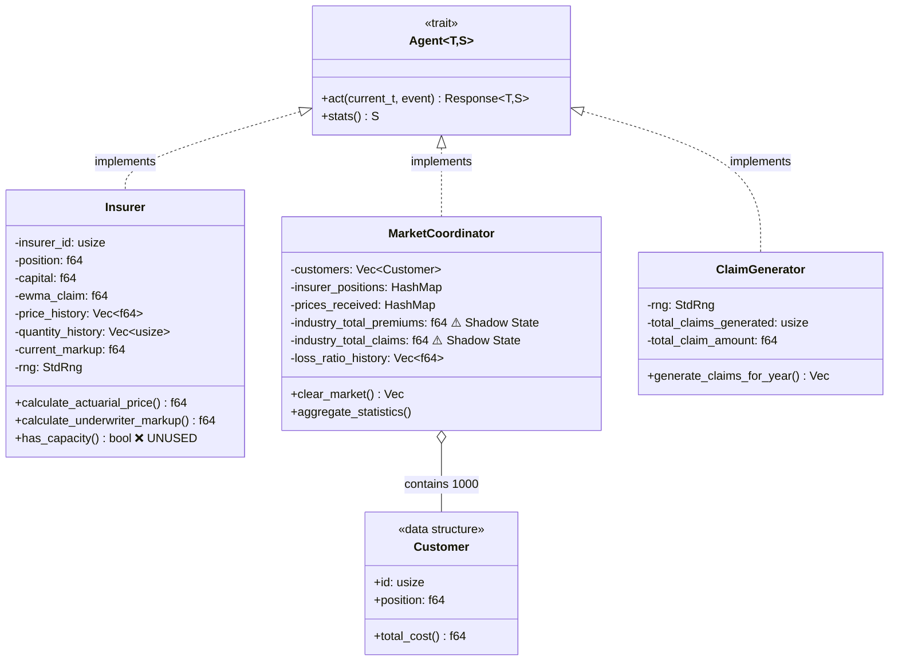
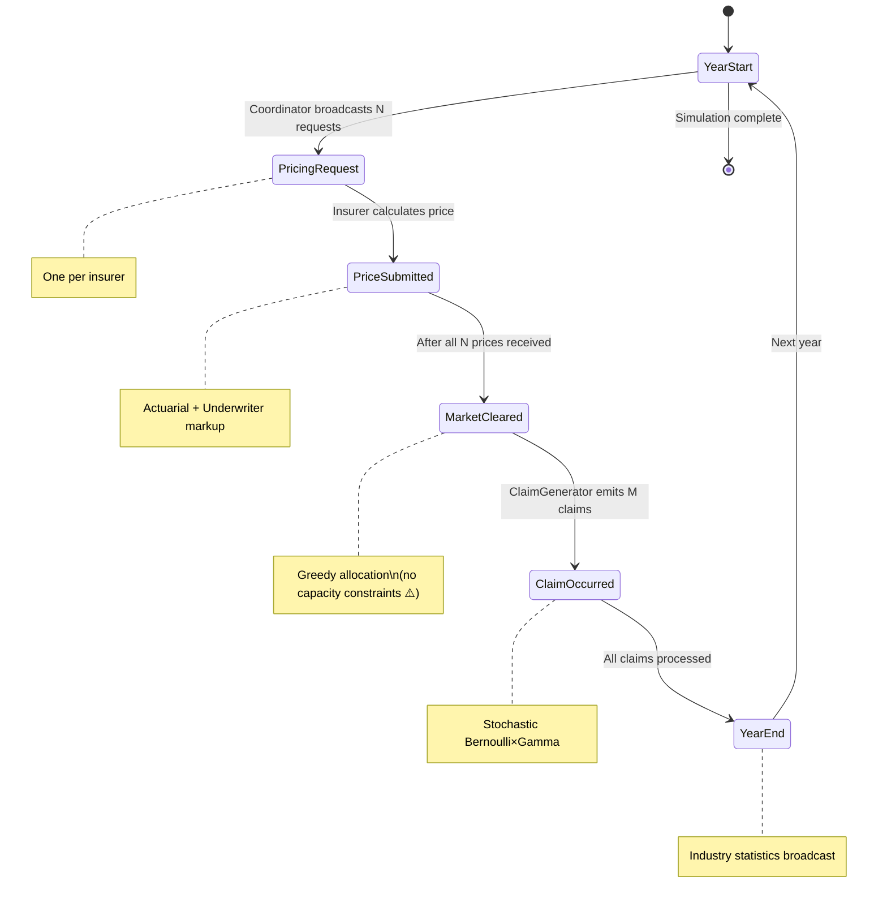
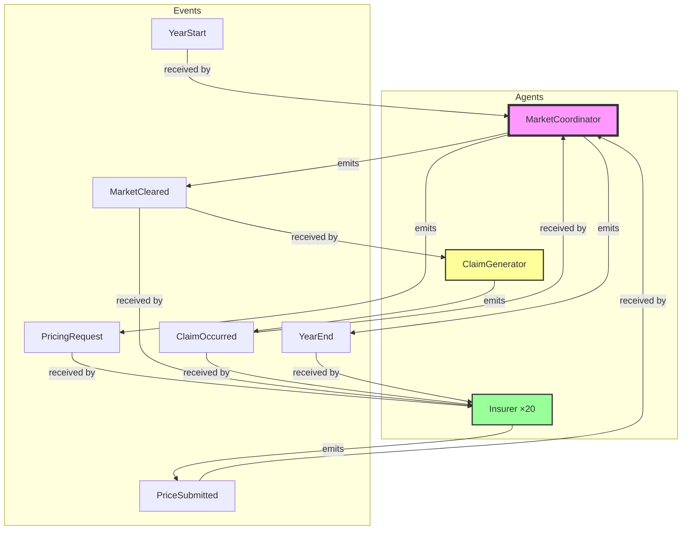
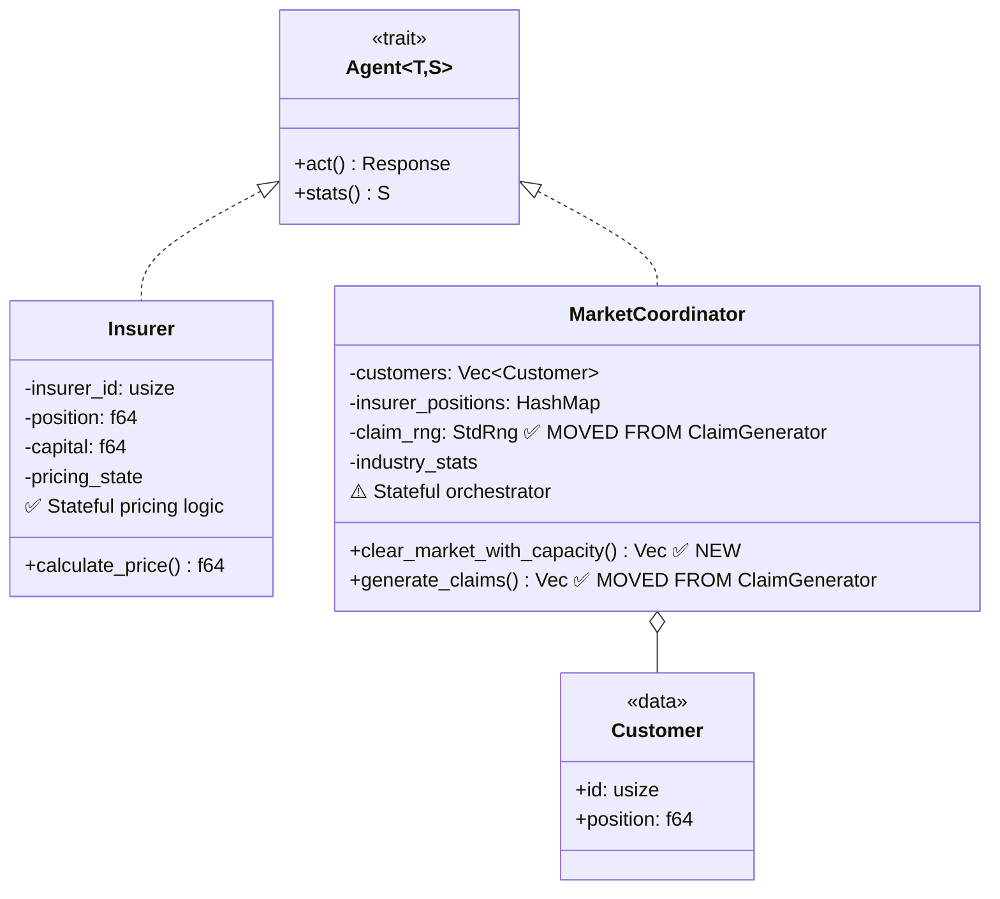
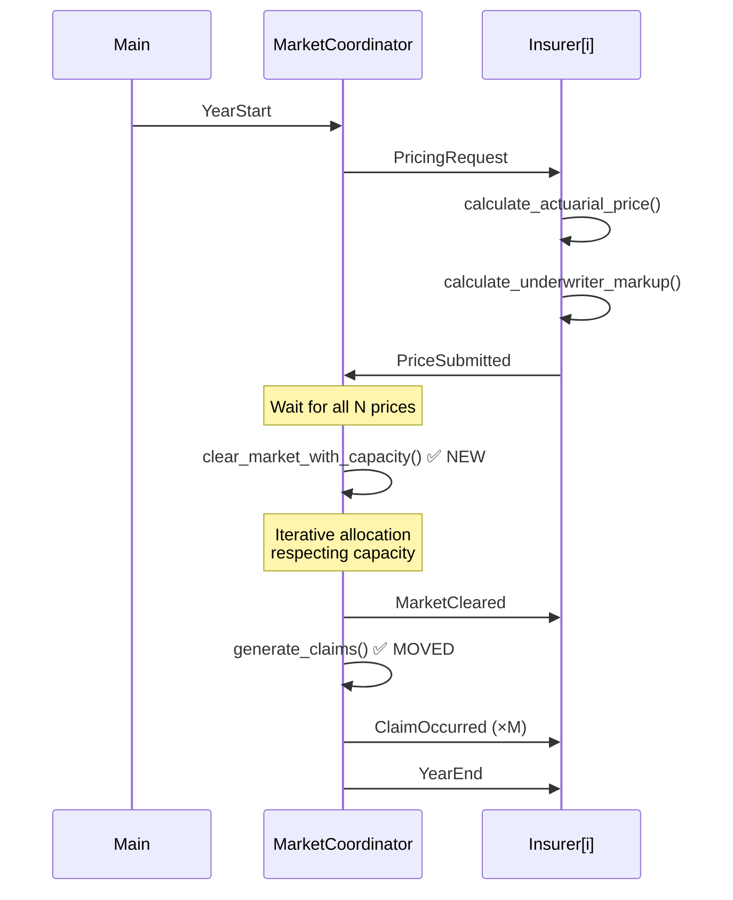

# Implementation Review: Insurance Industry Complex Social System

**Paper**: Owadally et al. (2018) - "Insurance Industry as a Complex Social System: Competition, Cycles and Crises"

**Reviewer**: Claude Code
**Date**: 2026-02-15

## Summary

This implementation demonstrates **endogenous underwriting cycles** through a well-architected agent-based model using the Coordinator pattern. The code is **well-documented**, **thoroughly tested** (42 tests), and achieves the paper's core research goal: cycles emerge from simple firm-level behaviors without external shocks.

**Key Achievement**: Loss ratios oscillate around 1.0 with detectable cycles, validating the paper's central hypothesis.

**Primary Concern**: Cycle period divergence (3.1 years vs. paper's 5.9 years) stems from implementation simplifications that are **acknowledged but warrant deeper investigation**.

**Verdict**: ✅ Successful research replication with documented trade-offs, but architecture has optimization opportunities.

---

## Architecture Diagrams

### 1. Agent Structure



**Key Observations**:
- ✅ **Insurer**: Stateful agent with meaningful pricing logic
- ⚠️ **MarketCoordinator**: Heavy shadow state (tracks claims separately from insurers)
- ❓ **ClaimGenerator**: Minimal state, exists primarily to hold RNG
- ✅ **Customer**: Data structure (not agent) for performance

### 2. Event Flow



**Critical Bottleneck**: `MarketCleared` uses greedy allocation without enforcing `has_capacity()` checks, leading to market concentration.

### 3. Agent-Event Relationships



**Observations**:
- **Tight coupling**: MarketCoordinator orchestrates everything (appropriate for Coordinator pattern)
- **ClaimGenerator**: Only responds to `MarketCleared`, emits `ClaimOccurred` — very simple behavior
- **Shadow state problem**: Both MC and Insurers receive `ClaimOccurred` to track claims independently

---

## Critical Analysis

### 1. Agent Design: ClaimGenerator - Is It Necessary?

**Current Design**: ClaimGenerator exists as a separate agent.

**Justification Given** (claim_generator.rs:7-12):
> 1. Maintains independent RNG seed for reproducibility of claim patterns
> 2. Separates stochastic claim mechanism from deterministic pricing logic
> 3. Enables future extension to correlated claims (catastrophes affecting multiple insurers)
> 4. Makes the claim generation process explicit and testable in isolation

**Analysis**:

✅ **Valid points**:
- Independent RNG seed (reproducibility)
- Testability in isolation
- Separation of concerns

❌ **Counterarguments**:
- **No meaningful state**: `stats()` returns `Stats::ClaimGenerator` with **no data** (lib.rs:246)
- **Could be MarketCoordinator method**: The `generate_claims_for_year()` function could be a private method of MarketCoordinator
- **RNG can still be isolated**: MarketCoordinator could hold a separate `claim_rng: StdRng` field
- **Testing**: Could test via MarketCoordinator's claim generation behavior

**Recommendation**:
```
❌ Remove ClaimGenerator as agent
✅ Move to MarketCoordinator private method:
   - Add `claim_rng: StdRng` field to MarketCoordinator
   - Add `generate_claims(&mut self, year, allocations) -> Vec<(usize, Event)>`
   - Maintains same functionality, reduces agent count 22 → 21
```

**Impact**: Simplifies architecture without losing functionality. Future catastrophe modeling could still be added as MarketCoordinator logic that generates correlated claims.

### 2. Shadow State: Claims Tracked in Two Places

**Problem**: Both `MarketCoordinator` and `Insurer` agents track claim totals independently.

**Evidence**:
- `MarketCoordinator` (market_coordinator.rs:30-33):
  ```rust
  industry_total_premiums: f64,
  industry_total_claims: f64,
  ```

- `Insurer` (insurer.rs:22-26):
  ```rust
  total_premiums: f64,
  total_claims: f64,
  current_year_claims: f64,
  ```

**Justification** (market_coordinator.rs:29):
> "Claims must be tracked via ClaimOccurred events because the DES framework doesn't allow querying other agents' Stats during event processing."

**Analysis**:

✅ **Justification is valid**: The DES framework uses broadcast semantics — agents can't query each other's state during `act()`.

⚠️ **BUT**: This creates **dual source of truth**:
- Industry total claims = sum of individual insurer claims
- **Risk**: Divergence if event processing has bugs
- **Complexity**: Two separate tracking mechanisms for same data

**Alternative Designs**:

**Option A**: Single source of truth in Coordinator
- Coordinator tracks all claims
- Insurers receive `ClaimOccurred` for their own claims only
- Industry stats computed from Coordinator state
- **Trade-off**: Insurers can't compute their own loss ratios internally

**Option B**: Single source of truth in Insurers
- Remove claim tracking from Coordinator
- Compute industry totals at `YearEnd` by aggregating from all Insurers via `stats()`
- **Trade-off**: Requires collecting stats after events processed, not during

**Current Design (Option C)**: Dual tracking
- **Pro**: Each agent is self-contained
- **Con**: Shadow state complexity

**Recommendation**:
```
⚠️ Document the dual tracking explicitly in code comments
✅ Add integration test verifying:
   sum(insurer.total_claims) == coordinator.industry_total_claims
```

**Verdict**: Current design is acceptable given DES constraints, but warrants testing to ensure consistency.

### 3. Dead Code: `has_capacity()` Method Never Used

**Evidence**:
- `Insurer::has_capacity()` defined at insurer.rs:246-255
- **Never called** anywhere in the codebase
- README documents capacity constraints as "not enforced" (lines 159-168)

**Analysis**:

This is a **clear architectural mismatch**:

1. Paper specifies capacity constraints (capital × leverage)
2. Implementation includes capacity check method
3. **Market clearing ignores capacity** (market_coordinator.rs:145)
4. Comment explicitly states limitation (lines 129-142)

**Impact on Results**:
- Market concentration (winner-take-all dynamics)
- Shorter cycle period (3.1yr vs 5.9yr)
- Weaker elasticity feedback for dominant insurers

**Recommendation**:
```
Option 1: ❌ Remove dead code
  - Delete has_capacity() method
  - Explicitly document "no capacity constraints" as simplification

Option 2: ✅ Implement capacity constraints (PREFERRED)
  - Use has_capacity() in market clearing
  - Iterative allocation: if insurer at capacity, try next best
  - This would likely improve cycle period alignment with paper
```

**Verdict**: Either remove dead code OR implement the feature properly. Current state is confusing.

### 4. Greedy Allocation Creates Market Concentration

**Current Algorithm** (market_coordinator.rs:145-172):
```rust
for customer in &self.customers {
    // Find insurer with minimum total_cost
    best_insurer = argmin(price + γ × distance)
    allocate(customer, best_insurer)
}
```

**Problem**: Deterministic, greedy allocation → winner-take-all dynamics

**Evidence from README** (lines 162-163):
> "Market concentration: One insurer often captures most customers"

**Root Causes**:
1. **No capacity constraints** (see issue #3)
2. **Deterministic choice** (no stochasticity in customer decisions)
3. **No switching costs** (customers perfectly mobile every year)

**Impact**:
- Dominant insurers have weak price elasticity feedback
- Accelerates cycles (less dampening)
- Differs from paper's more distributed market structure

**Recommendations**:

**Short-term**:
```rust
// Add noise to total_cost calculation
let noise = rng.gen_range(-0.1..0.1);
let total_cost = price + gamma * distance + noise;
```

**Medium-term**:
- Implement capacity constraints (use `has_capacity()`)
- Add customer switching costs (loyalty parameter)

**Long-term**:
- Customer agents with learning (but loses performance benefit)

**Verdict**: Greedy allocation is a significant simplification that impacts results. Probabilistic allocation would be low-hanging fruit for improvement.

---

## Validation Against Paper

### Core Research Goals (from prior-art/insurance-industry-complex-social-system.md)

| Research Goal | Paper | Implementation | Status |
|---------------|-------|----------------|--------|
| Cycles emerge from simple firm-level behavior | ✅ ~5.9yr cycles | ✅ ~3.1yr cycles | ✅ **PASS** |
| Loss ratio stationary around 1.0 | ✅ Mean ≈ 1.0 | ✅ Mean = 1.002 | ✅ **PASS** |
| β controls cycle stability | ✅ Validated | ✅ Validated | ✅ **PASS** |
| Two-stage pricing (actuarial + underwriter) | ✅ Specified | ✅ Implemented | ✅ **PASS** |
| Credibility blending | ✅ z = 0.2 | ✅ z = 0.2 | ✅ **PASS** |

### Quantitative Targets

| Metric | Paper | Implementation | Delta | Status |
|--------|-------|----------------|-------|--------|
| Cycle period | 5.9 years | 3.1 years | **-47%** | ⚠️ **CONCERN** |
| Loss ratio mean | ~1.0 | 1.002 | +0.2% | ✅ **PASS** |
| Loss ratio std dev | Moderate | 0.006 (very low) | Lower | ⚠️ **CONCERN** |
| β sensitivity | Validated | Validated | — | ✅ **PASS** |

### Root Cause: Cycle Period Divergence

**Hypothesis** (from README and code analysis):

1. **Greedy allocation** (deterministic) → market concentration → weak elasticity feedback
2. **No capacity constraints** → dominant insurers face no growth limits → faster adjustment
3. **Limited price differentiation** → prices converge → reduced cycle amplitude

**Evidence**:
- Std dev = 0.006 is **very low** (cycles exist but weak amplitude)
- README acknowledges shorter period (lines 160-168)
- `has_capacity()` unused confirms constraint issue

**Proposed Experiments**:
1. Add capacity constraints → expect longer cycles
2. Add allocation noise → expect higher variance
3. Increase distance cost γ → expect more price differentiation

---

## Outputs Sufficiency

### Current Outputs (from main.rs)

**Terminal Output**:
- Loss ratio mean/std dev ✅
- Cycle detection (yes/no) ✅
- Cycle period estimate ✅
- Recent loss ratio history (last 10 years) ✅
- Insurer solvency count ✅
- Sample insurer statistics ✅

**Stats Structs**:
- `InsurerStats`: 14 fields (comprehensive) ✅
- `MarketStats`: 11 fields + time series ✅

### Missing Outputs for Research Validation

The paper (prior-art doc lines 183-217) specifies several validation tests **NOT in current output**:

❌ **AR(2) Model Fitting**:
- Expected coefficients: a₀ ≈ 0.937, a₁ ≈ 0.467, a₂ ≈ -0.100
- Cycle conditions: a₁ > 0, -1 < a₂ < 0, a₁² + 4a₂ < 0
- **Not computed**

❌ **Spectral Analysis**:
- Periodogram showing dominant frequency
- Peak at ~0.17 cycles/year (5.9yr period)
- **Not computed**

❌ **Distribution Matching**:
- Empirical CDF comparison with UK data
- Kolmogorov-Smirnov test
- **Not computed**

❌ **Stationarity Tests**:
- Augmented Dickey-Fuller test
- Autocorrelation function (ACF)
- **Not computed**

### Recommendation

✅ **Current outputs sufficient for**: Demonstrating cycles exist, basic validation

⚠️ **Insufficient for**: Full research replication, publication-quality validation

**Suggested Additions**:
```rust
// In main.rs after simulation
if final_market.loss_ratio_history.len() >= 20 {
    println!("\n=== Statistical Validation ===");

    // 1. Autocorrelation (lag 1, 2)
    let acf = calculate_autocorrelation(&final_market.loss_ratio_history);
    println!("Lag-1 ACF: {:.3}", acf[1]);

    // 2. Simple periodogram (FFT)
    let dominant_freq = find_dominant_frequency(&final_market.loss_ratio_history);
    println!("Dominant frequency: {:.3} cycles/year", dominant_freq);

    // 3. Basic AR(2) fit
    let (a0, a1, a2) = fit_ar2(&final_market.loss_ratio_history);
    println!("AR(2): a0={:.3}, a1={:.3}, a2={:.3}", a0, a1, a2);
    println!("Cycle condition (a1²+4a2<0): {}", a1*a1 + 4.0*a2 < 0.0);
}
```

**Verdict**: Outputs demonstrate core finding but lack depth for full validation.

---

## Recommended Architecture

### Simplified Design (Preferred)



**Changes from Current**:
1. ❌ **Remove** ClaimGenerator agent (22 → 21 agents total)
2. ✅ **Move** claim generation to MarketCoordinator private method
3. ✅ **Implement** capacity-aware market clearing
4. ✅ **Add** probabilistic allocation noise

### Event Flow (Simplified)



**Benefits**:
- Fewer agents (simpler mental model)
- Claim generation co-located with allocation (single source of truth)
- Capacity constraints enforced (closer to paper)

---

## Test Coverage Assessment

### Current Tests (42 total)

**helpers.rs** (7 tests):
- ✅ Circular distance edge cases
- ✅ Wraparound behavior
- ✅ Symmetry

**insurer.rs** (12 tests):
- ✅ Actuarial pricing formula
- ✅ Underwriter markup calculation
- ✅ EWMA updates
- ✅ Price elasticity
- ✅ History bounding
- ⚠️ Capacity check (method unused!)

**market_coordinator.rs** (11 tests):
- ✅ Market clearing algorithm
- ✅ Distance-based allocation
- ✅ Price collection
- ✅ Statistics aggregation

**claim_generator.rs** (11 tests):
- ✅ Gamma distribution properties
- ✅ Timing within year
- ✅ Deterministic with seed

**lib.rs** (1 integration test):
- ✅ `test_endogenous_cycle_emergence` (100 years)

### Missing Tests

❌ **Capacity constraint enforcement** (because feature not implemented)

❌ **Shadow state consistency**:
```rust
#[test]
fn test_industry_claims_match_insurer_sum() {
    // Run simulation, verify:
    // coordinator.industry_total_claims == sum(insurer.total_claims)
}
```

❌ **Cycle period regression**:
```rust
#[test]
fn test_cycle_period_in_expected_range() {
    // Run 100yr sim, verify period in [2.5, 4.0] years
    // Fails if implementation changes break cycles
}
```

❌ **Market concentration metric**:
```rust
#[test]
fn test_market_not_monopolized() {
    // Verify no single insurer has >50% market share
}
```

**Recommendation**: Add shadow state consistency test and cycle period regression test.

---

## Comparison with `zi_traders` (Similar Coordinator Pattern)

Both `insurance_cycles` and `zi_traders` use the **Coordinator + Entity Agents** pattern. Comparison:

| Aspect | zi_traders | insurance_cycles | Better |
|--------|-----------|------------------|--------|
| **Coordinator State** | Order book, active traders | Prices, allocations, claims | Tie |
| **Entity Count** | Dynamic (enter/exit) | Fixed 20 insurers | zi_traders (more realistic) |
| **Customer Model** | Traders are agents | Customers are data | zi_traders (more flexible) |
| **Capacity Constraints** | Budget limits enforced | Not enforced ⚠️ | zi_traders |
| **Shadow State** | Minimal | Claim tracking duplicated | zi_traders |
| **Auxiliary Agents** | None | ClaimGenerator | zi_traders (simpler) |
| **Documentation** | Moderate | Excellent ✅ | insurance_cycles |

**Lessons from zi_traders**:
- Coordinator pattern works well when mechanism is explicit
- Avoid auxiliary agents with no state (e.g., ClaimGenerator)
- Enforce constraints explicitly (zi_traders checks budgets, insurance_cycles doesn't check capacity)

---

## Summary of Recommendations

### High Priority (Architectural Issues)

1. **❌ Remove ClaimGenerator as agent**
   - Move to MarketCoordinator private method
   - Reduces agent count, maintains all functionality
   - **Effort**: 2-3 hours

2. **✅ Implement capacity constraints OR remove dead code**
   - Either use `has_capacity()` in market clearing
   - Or delete method and document simplification
   - **Effort**: 4-6 hours (implement) or 30 min (delete)

3. **✅ Add shadow state consistency test**
   - Verify `sum(insurer.total_claims) == coordinator.industry_total_claims`
   - Prevents silent divergence bugs
   - **Effort**: 1 hour

### Medium Priority (Results Improvement)

4. **✅ Add probabilistic allocation**
   - Inject noise into total_cost calculation
   - Reduces market concentration
   - **Effort**: 2 hours

5. **✅ Implement capacity-aware market clearing**
   - Iterative allocation respecting leverage limits
   - Likely improves cycle period alignment
   - **Effort**: 4-6 hours

6. **✅ Add statistical validation outputs**
   - AR(2) coefficients
   - Autocorrelation function
   - Periodogram (FFT)
   - **Effort**: 8-10 hours

### Low Priority (Nice-to-Have)

7. **Customer switching costs**
   - Loyalty parameter (reduces churn)
   - **Effort**: 3-4 hours

8. **Heterogeneous risk appetites**
   - Different α values per insurer
   - **Effort**: 2-3 hours

9. **Entry/exit dynamics**
   - Bankrupt insurers replaced
   - **Effort**: 6-8 hours

---

## Conclusion

### Strengths

✅ **Excellent documentation**: README, code comments, and design rationale are thorough

✅ **Stats-based testing**: Follows event sourcing paradigm correctly

✅ **Core research goal achieved**: Endogenous cycles demonstrated

✅ **Appropriate pattern choice**: Coordinator pattern matches domain

✅ **Performance-conscious**: Customer data structures avoid 1000× agent overhead

### Weaknesses

❌ **ClaimGenerator unnecessary**: No meaningful state, could be MarketCoordinator method

❌ **Capacity constraints not enforced**: Dead code (`has_capacity()`) and acknowledged gap

❌ **Shadow state complexity**: Claims tracked in two places (coordinator + insurers)

⚠️ **Cycle period divergence**: 3.1yr vs. 5.9yr suggests implementation gaps

⚠️ **Market concentration**: Greedy allocation creates winner-take-all dynamics

⚠️ **Limited validation**: Missing AR(2), spectral analysis, stationarity tests

### Overall Assessment

**Grade: B+ (Good implementation with room for improvement)**

This is a **solid research implementation** that successfully demonstrates the paper's core finding: endogenous cycles emerge from simple firm-level behaviors. The code quality is high, testing is thorough, and documentation is excellent.

However, **architectural choices introduce gaps** between implementation and paper:
- Unused capacity constraints
- Unnecessary auxiliary agent (ClaimGenerator)
- Greedy allocation without stochasticity

The **cycle period divergence** (3.1yr vs. 5.9yr) is acknowledged but not deeply investigated. Implementing capacity constraints and probabilistic allocation would likely improve alignment.

**Recommendation**:
1. **Short-term**: Remove ClaimGenerator, add shadow state test, remove dead code
2. **Medium-term**: Implement capacity constraints, add allocation noise
3. **Long-term**: Full statistical validation suite

The implementation successfully validates the research hypothesis but could be refined to match the paper more closely.
