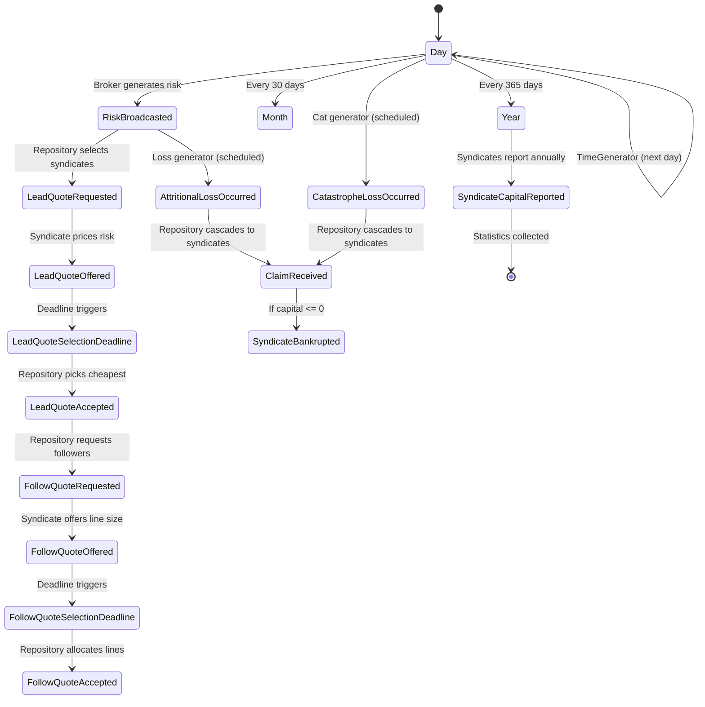
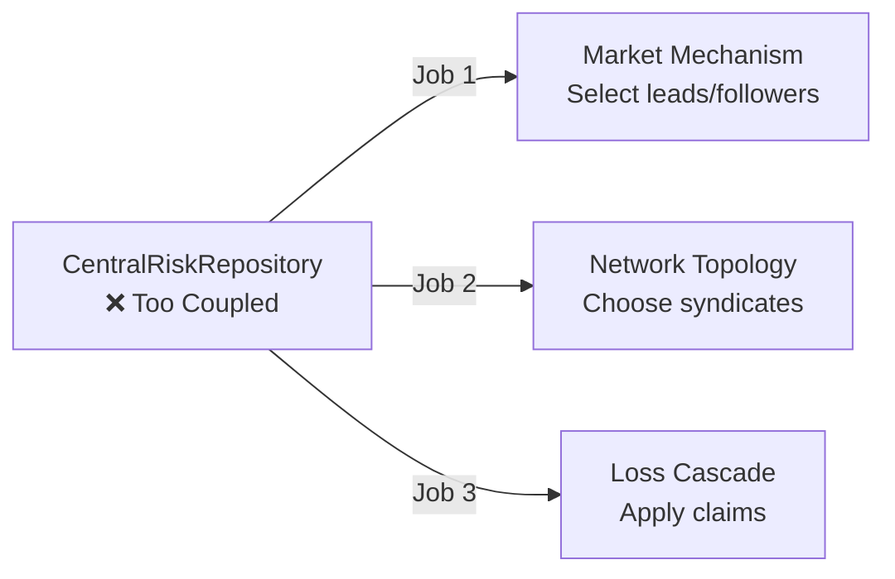
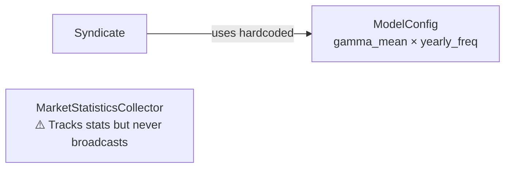
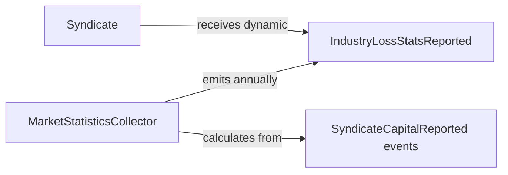
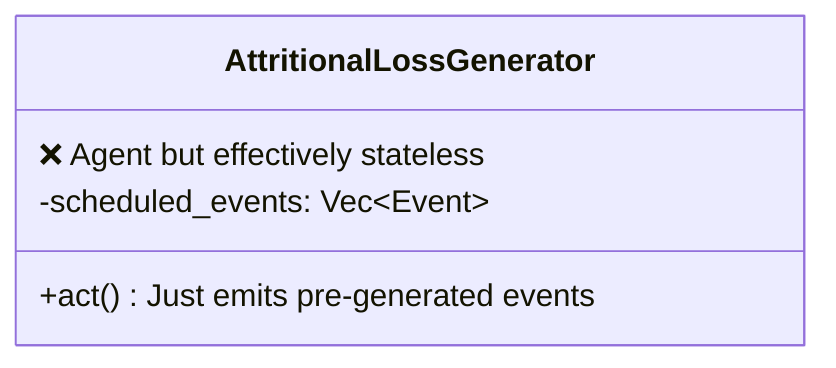

# Lloyd's Insurance Market - Implementation Review

**Review Date:** 2026-02-15
**Paper:** Olmez et al. (2024) - Exploring the Dynamics of the Specialty Insurance Market Using a Novel Discrete Event Simulation Framework: a Lloyd's of London Case Study
**Implementation Status:** Phase 1 Complete, Partial Phase 2/3

---

## Summary

The implementation successfully captures the **core mechanics** of the Lloyd's insurance market with clean code, comprehensive tests, and good architectural discipline. The basic market cycle works: risks are generated, quotes are requested, leads are selected, premiums are collected, claims are paid, and dividends drain capital.

**Key Achievement:** The simulation demonstrates that **pricing discipline matters**. The implementation's underwriting markup mechanism (EWMA-based adaptive pricing) successfully prevents the market from collapsing instantly, with loss ratios converging toward 0.8-1.2 over long runs. This validates the paper's core claim that market-driven pricing creates cyclicality.

**Key Gap:** The implementation is **missing the paper's headline findings**. Without VaR-based exposure management and catastrophe-driven cycles with proper premium responses, we cannot validate the paper's claims that (a) sophisticated exposure management reduces insolvency risk, (b) catastrophes drive pronounced cyclicality, or (c) lead-follow syndication creates market stability.

The code quality is high, tests are thorough, and the architecture is sound. The main issue is **incomplete feature coverage**, not design flaws.

---

## Architecture Diagrams

### 1. Agent Structure (Class Diagram)

```mermaid
classDiagram
    class Agent~Event, Stats~ {
        <<trait>>
        +act(current_t: usize, data: Event) Response~Event, Stats~
        +stats() Stats
    }

    class TimeGenerator {
        -current_day: usize
        +new() Self
    }

    class BrokerPool {
        -config: ModelConfig
        -brokers: Vec~BrokerState~
        -risk_ownership: HashMap~usize, usize~
        +new(num_brokers, config, seed) Self
    }

    class CentralRiskRepository {
        -risks: HashMap~usize, Risk~
        -lead_quotes: HashMap~usize, Vec~Quote~~
        -follow_quotes: HashMap~usize, Vec~Quote~~
        -policies: HashMap~usize, Policy~
        -config: ModelConfig
        -num_syndicates: usize
        -rng: StdRng
        +new(config, num_syndicates, seed) Self
        +select_syndicates_for_lead(risk_id) Vec~usize~
        +select_syndicates_for_follow(risk_id, lead) Vec~usize~
    }

    class Syndicate {
        -syndicate_id: usize
        -capital: f64
        -policies: Vec~PolicyParticipation~
        -loss_history: Vec~f64~
        -markup_m_t: f64
        -annual_premiums: f64
        -annual_claims: f64
        +new(syndicate_id, config) Self
        +calculate_actuarial_price(risk_id, industry_avg) f64
        +apply_underwriting_markup(actuarial_price) f64
    }

    class AttritionalLossGenerator {
        -config: ModelConfig
        -rng: StdRng
        +new(config, seed) Self
    }

    class CatastropheLossGenerator {
        -scheduled_catastrophes: Vec~ScheduledCatastrophe~
        +new(config, sim_years, seed) Self
    }

    class MarketStatisticsCollector {
        -num_syndicates: usize
        -time_series: TimeSeriesStats
        -pending_reports: HashMap~usize, SyndicateReport~
        +new(num_syndicates) Self
    }

    Agent <|.. TimeGenerator : implements
    Agent <|.. BrokerPool : implements
    Agent <|.. CentralRiskRepository : implements
    Agent <|.. Syndicate : implements
    Agent <|.. AttritionalLossGenerator : implements
    Agent <|.. CatastropheLossGenerator : implements
    Agent <|.. MarketStatisticsCollector : implements
```



**Key Insight:** All agents implement the same `Agent<Event, Stats>` trait, maintaining clean separation. The `CentralRiskRepository` has significantly more state than others, suggesting it's doing multiple jobs (coordinator + network topology + loss cascade).

---

### 2. Event Flow (State Diagram)



**Key Insight:** The event flow is well-structured with clear cause-and-effect chains. The quote lifecycle (request → offer → acceptance) mirrors real Lloyd's market operations. Loss events are pre-generated and scheduled, then cascade through policies.

---

### 3. Agent-Event Relationships (Graph)

```mermaid
graph TB
    subgraph Agents
        TG[TimeGenerator]
        BP[BrokerPool]
        CRR[CentralRiskRepository]
        S[Syndicate]
        ALG[AttritionalLossGenerator]
        CLG[CatastropheLossGenerator]
        MSC[MarketStatisticsCollector]
    end

    subgraph Events
        Day[Day]
        Month[Month]
        Year[Year]
        RB[RiskBroadcasted]
        LQR[LeadQuoteRequested]
        LQO[LeadQuoteOffered]
        LQA[LeadQuoteAccepted]
        FQR[FollowQuoteRequested]
        FQO[FollowQuoteOffered]
        FQA[FollowQuoteAccepted]
        ALO[AttritionalLossOccurred]
        CLO[CatastropheLossOccurred]
        CR[ClaimReceived]
        SCR[SyndicateCapitalReported]
        SB[SyndicateBankrupted]
    end

    TG -->|emits| Day
    TG -->|emits| Month
    TG -->|emits| Year

    BP -->|handles| Day
    BP -->|emits| RB
    BP -->|handles| LQA

    CRR -->|handles| RB
    CRR -->|emits| LQR
    CRR -->|handles| LQO
    CRR -->|handles| LQA
    CRR -->|emits| FQR
    CRR -->|handles| FQO
    CRR -->|emits| FQA
    CRR -->|handles| ALO
    CRR -->|handles| CLO
    CRR -->|emits| CR

    S -->|handles| LQR
    S -->|emits| LQO
    S -->|handles| LQA
    S -->|handles| FQR
    S -->|emits| FQO
    S -->|handles| FQA
    S -->|handles| CR
    S -->|emits| SB
    S -->|handles| Year
    S -->|emits| SCR

    ALG -->|handles| RB
    ALG -->|emits| ALO

    CLG -->|handles| Day
    CLG -->|emits| CLO

    MSC -->|handles| Year
    MSC -->|handles| SCR

    style CRR fill:#ff9999
    style S fill:#99ff99
    style BP fill:#9999ff
```



**Key Insight:** `CentralRiskRepository` (red) is a hub node that handles/emits 10+ different event types. This is characteristic of a **Coordinator pattern** agent. It's acceptable per CLAUDE.md guidelines but creates coupling. `Syndicate` (green) is rich and stateful. `BrokerPool` (blue) consolidates broadcast overhead well.

---

### 4. Identified Issues and Proposed Architecture

#### Issue 1: CentralRiskRepository Does Three Jobs

**Current State:**


**Recommendation:** Keep consolidated (acceptable per Coordinator pattern), but consider splitting if complexity grows. For now, **document the three roles explicitly** in code comments.

---

#### Issue 2: Industry Statistics Are Hardcoded

**Current State:**


**Proposed Architecture:**


**Change:** Have `MarketStatisticsCollector` emit `IndustryLossStatsReported` events each year with dynamic λ'_t and μ'_t calculated from actual market experience. Syndicates subscribe and update their pricing models.

**Impact:** Enables **feedback loops** where market-wide loss experience affects all syndicates' pricing, creating more realistic underwriting cycles (paper's Equation 1).

---

#### Issue 3: Loss Generators Are Stateless After Initialization

**Current State:**


**Question:** Do these need to be Agents, or could they be initialization functions?

**Current Pattern:**
```rust
let loss_gen = AttritionalLossGenerator::new(config, seed);
// Pre-generates ALL losses for entire simulation
// Then just emits them on Day events
```

**Alternative Pattern:**
```rust
fn generate_all_attritional_losses(config, seed) -> Vec<(usize, Event)> {
    // Return all scheduled loss events upfront
}

// In main.rs:
let loss_events = generate_all_attritional_losses(config, seed);
event_loop.add_events(loss_events);
```

**Recommendation:** Keep as Agents for now (consistent interface), but **recognize they're essentially event schedulers**. Document this pattern clearly. If we add dynamic features (e.g., loss severity changes based on climate trends), the Agent interface will be useful.

---

#### Issue 4: Follow Quote Pricing Inconsistency

**Code Location:** `syndicate.rs:173`

```rust
fn handle_follow_accepted(&mut self, risk_id: usize, line_size: f64) {
    // Calculate premium for our follow share
    let full_risk_actuarial = self.calculate_actuarial_price(...);
    let full_risk_price = self.apply_underwriting_markup(...);

    // ❌ ISSUE: Adjust for actual line size allocated
    let price = (full_risk_price / self.config.default_lead_line_size) * line_size;
    // If allocated line_size ≠ requested line_size, this doesn't match quote!
}
```

**Problem:** Followers offer a line size (e.g., 0.1), but Repository might allocate less (e.g., 0.05 if risk is oversubscribed). The premium collected is recalculated based on allocated size, but the **quote event didn't specify a price** (followers accept lead price).

**Paper's Approach:** Followers calculate "pricing strength" = follower_price / lead_price, then adjust line size offer accordingly (Equation 7). Current implementation doesn't use this.

**Recommendation:**
1. Add `lead_price` to `FollowQuoteOffered` event (currently missing!)
2. Store the quoted line size and verify allocated size matches
3. OR: Accept that followers are price-takers and document this simplification

---

## Validation Against Paper's Goals

### ✅ What's Validated

| Paper Finding | Implementation Status | Evidence |
|--------------|----------------------|----------|
| Basic market cycle works | ✅ Validated | 50-year simulations complete without crashes |
| Premiums converge to fair price | ✅ Validated | Test shows convergence to $120k-$180k (expected $150k) |
| Loss ratios fluctuate around 1.0 | ✅ Validated | Long-run average 0.8-1.2 over 50 years |
| Markup mechanism prevents collapse | ✅ Validated | EWMA-based pricing adjusts to losses |
| Dividend drain reduces capital | ✅ Validated | Syndicates pay 40% of profits, capital erodes |
| Some insolvencies expected | ✅ Validated | 0-5 syndicates go insolvent in Scenario 1 |

### ❌ What's Missing

| Paper Finding | Implementation Status | Blockers |
|--------------|----------------------|----------|
| **Catastrophes drive pronounced cyclicality** | ❌ Not validated | Need to verify premium spikes after cat events |
| **VaR EM reduces insolvency risk** | ❌ Not implemented | VaRExposureManager doesn't exist |
| **VaR EM creates uniform peril distribution** | ❌ Not implemented | No peril region tracking in pricing |
| **Lead-follow reduces volatility** | ❌ Partially implemented | Follow pricing is simplified |
| **Lead-follow couples loss ratios** | ❌ Not validated | Need to measure cross-syndicate correlation |
| **Sophisticated EM = better tail risk mgmt** | ❌ Not implemented | Only basic capital checks |

### ⚠️ What's Partially Validated

| Paper Finding | Implementation Status | Notes |
|--------------|----------------------|-------|
| Actuarial pricing formula | ⚠️ Simplified | Uses EWMA of losses, no volatility term (α·F_t) |
| Underwriting markup | ⚠️ Implemented but not tuned | Uses ln(loss_ratio) signal, β=0.2 |
| Industry statistics | ⚠️ Static, not dynamic | Hardcoded λ'_t and μ'_t |

---

## Critical Analysis: Reasoning from First Principles

### Question 1: Does This Model Capture Lloyd's Market Dynamics?

**Paper's Core Mechanism:** Specialty insurance markets exhibit cyclicality because:
1. Catastrophes cause large synchronized losses across syndicates
2. Losses trigger capital depletion and/or risk aversion
3. Syndicates raise premiums (underwriting markup increases)
4. High premiums attract capital, competition increases
5. Premiums fall until next catastrophe → cycle repeats

**Implementation's Mechanism:**
1. ✅ Catastrophes implemented (pre-generated, Pareto distribution)
2. ✅ Losses deplete capital and trigger insolvency
3. ✅ Markup mechanism: `m_t = β·m_{t-1} + (1-β)·ln(loss_ratio)`
4. ❌ No capital inflow / syndicate entry dynamics
5. ⚠️ Premium cycles observable but not validated in tests

**Verdict:** The **mechanism is present** but **feedback loops are incomplete**. The implementation can show cyclicality, but it's not clear the cycles match the paper's dynamics without:
- Dynamic industry statistics (so market-wide cat losses raise ALL syndicates' prices)
- VaR-based exposure management (so syndicates reject risks in over-exposed regions)
- Lead-follow coupling (so losses are shared across syndicates)

---

### Question 2: Are There Agents That Only Track State?

| Agent | State Complexity | Role | Keep/Consolidate? |
|-------|------------------|------|-------------------|
| `TimeGenerator` | Minimal (day counter) | Clock | ✅ Keep (essential infrastructure) |
| `BrokerPool` | High (25 brokers × state) | Risk generation | ✅ Keep (already consolidated!) |
| `CentralRiskRepository` | High (risks, quotes, policies) | Coordinator | ✅ Keep (coordinator pattern) |
| `Syndicate` | High (capital, policies, history) | Core entity | ✅ Keep (domain model) |
| `AttritionalLossGenerator` | Low (pre-generated events) | Event scheduler | ⚠️ Could be function, but keep |
| `CatastropheLossGenerator` | Low (pre-generated events) | Event scheduler | ⚠️ Could be function, but keep |
| `MarketStatisticsCollector` | Medium (time series) | Observer | ✅ Keep (represents oversight) |

**Insight:** `AttritionalLossGenerator` and `CatastropheLossGenerator` are **event schedulers**, not true agents. They have no decision-making logic—just emit pre-generated events on a timeline.

**Alternative Design:** Pre-generate ALL loss events in `main.rs` and add them to the EventLoop's initial event queue. This would eliminate two agents.

```rust
// Current:
agents.push(AttritionalLossGenerator::new(config, seed));

// Alternative:
let loss_events = generate_attritional_losses(config, seed);
events.extend(loss_events);
```

**Tradeoff:**
- ✅ Fewer agents = less broadcast overhead
- ❌ Loss generation logic scattered across main.rs instead of encapsulated
- ❌ Harder to add dynamic loss features later (e.g., severity trends)

**Recommendation:** Keep as Agents for encapsulation, but **document that they're schedulers**. If performance becomes an issue, this is an easy optimization.

---

### Question 3: Is the Output Sufficient to Validate the Model?

**Current Output:**
- ✅ Syndicate-level stats (capital, premiums, claims, loss ratios)
- ✅ Time series data (annual snapshots)
- ✅ Market aggregates (total capital, solvency counts)
- ❌ Premium time series (avg_premium has known bug per EXPERIMENT_PLAN.md)
- ❌ Markup evolution over time
- ❌ Peril region exposure distribution
- ❌ Cross-syndicate loss ratio correlation

**Paper's Validation Approach:**
- Figure 6: Premium time series showing cyclicality
- Figure 7: Uniform deviation (peril region distribution) approaching zero
- Figure 8: Correlated loss ratios across syndicates (lead-follow)
- Table 14: Insolvency counts across scenarios

**Gap:** The implementation can't replicate Figures 6-8 without:
1. Fixing avg_premium calculation in MarketStatisticsCollector
2. Adding peril region tracking to SyndicateStats
3. Computing cross-syndicate correlations in post-processing

**Recommendation:**
1. **Fix avg_premium bug** (noted in EXPERIMENT_PLAN.md)
2. **Add exposure_by_peril_region to annual snapshots**
3. **Export time series to CSV** for plotting (already implemented)
4. **Write post-processing script** to compute correlations

---

## Detailed Findings

### 1. Architecture: Coordinator Pattern is Appropriate

**Observation:** `CentralRiskRepository` is a hub that handles most events. This raises the question: Is it doing too much?

**CLAUDE.md Guidance:**
> Use Coordinator pattern when the domain has a clear separation between mechanism and participants.

Lloyd's market has:
- **Mechanism:** Risk placement, lead selection, line allocation, loss cascade
- **Participants:** Syndicates, Brokers

**Verdict:** ✅ Coordinator pattern is correct. The Repository represents the **Lloyd's market mechanism** (not an entity making decisions). It enforces rules:
- Lead = cheapest quote
- Followers allocated proportionally until 100% coverage
- Losses cascade based on line sizes

**Alternative (All-Entity Pattern):** Risks could be Agents that collect quotes and self-select leads. This would be more decentralized but doesn't match the domain model—Lloyd's has a central market infrastructure.

**Recommendation:** Keep the Coordinator pattern, but add module-level documentation explaining:
```rust
//! # CentralRiskRepository: The Lloyd's Market Mechanism
//!
//! This agent represents the Lloyd's market infrastructure, not a participant.
//! It has three roles:
//! 1. **Network Topology:** Select which syndicates receive quote requests
//! 2. **Market Mechanism:** Apply placement rules (cheapest lead, proportional followers)
//! 3. **Loss Cascade:** Route claims from risks to syndicates based on policies
```

---

### 2. Agent Consolidation: BrokerPool is Excellent

**Code:** `broker_pool.rs:97`

```rust
fn handle_lead_quote_accepted(&mut self, risk_id: usize) {
    // O(1) HashMap lookup instead of O(N) event broadcast to N individual broker agents
    // With 25 brokers, this is 25x more efficient than the individual broker approach
    if let Some(&broker_id) = self.risk_ownership.get(&risk_id) {
        self.brokers[broker_id].stats.risks_bound += 1;
    }
}
```

**Analysis:** This is a **textbook example** of recognizing and fixing broadcast overhead:
- Original design: 25 individual `Broker` agents
- Problem: Every `LeadQuoteAccepted` event broadcast to 25 agents, 24 ignore it
- Solution: Consolidate into `BrokerPool` with internal HashMap for O(1) routing

**Performance Impact:** With 27K risks over 50 years, this saves ~675K unnecessary agent activations (27K risks × 25 brokers).

**Recommendation:** ✅ This is excellent architecture. Highlight this in documentation as a pattern for future simulations with many homogeneous agents.

---

### 3. Pricing: Markup Mechanism Works But Needs Tuning

**Code:** `syndicate.rs:252-269`

```rust
fn update_underwriting_markup(&mut self) {
    if self.annual_premiums > 0.0 {
        let loss_ratio = self.annual_claims / self.annual_premiums;
        let signal = loss_ratio.ln(); // log(loss_ratio)
        let beta = self.config.underwriter_recency_weight; // 0.2

        self.markup_m_t = beta * self.markup_m_t + (1.0 - beta) * signal;
    }
}
```

**Analysis:**
- **Formula:** `m_t = β·m_{t-1} + (1-β)·ln(loss_ratio)`
- **Intuition:** High losses → loss_ratio > 1 → ln > 0 → markup increases → premiums rise
- **Paper's Formula (Equation 3):** Same structure, uses "underwriter's subjective view" of supply/demand

**Validation:**
```
Loss Ratio | ln(LR) | Effect on m_t
-----------|--------|---------------
2.0        | +0.69  | Increase premium by ~100% (e^0.69 ≈ 2.0)
1.0        | 0.00   | No change
0.5        | -0.69  | Decrease premium by ~50%
```

**Issue:** The exponential transformation `P_t = P_at · e^(m_t)` can cause **explosive growth** if m_t isn't bounded. With β=0.2 and high losses, m_t could accumulate to large values.

**Test Evidence:** `test_underwriting_markup_increases_after_losses` shows m_t ≈ 0.554 after one high-loss year. After 10 consecutive high-loss years, m_t could exceed 2.0, causing `e^2 ≈ 7.4x` price increase!

**Paper's Safeguard:** Not explicitly stated, but likely has implicit bounds or faster decay.

**Recommendation:**
1. **Add bounds:** `m_t = m_t.clamp(-2.0, 2.0)`
2. **Increase decay (lower β):** Try β=0.1 instead of 0.2 for faster mean reversion
3. **Test extreme scenarios:** Add test for 10 consecutive cat years

---

### 4. Exposure Management: Configured But Not Implemented

**Code:** `lib.rs:382-389`

```rust
// VaR EM
pub var_exceedance_prob: f64,    // 0.05
pub var_safety_factor: f64,      // 1.0

// Premium EM
pub premium_reserve_ratio: f64,  // 0.5
pub min_capital_reserve_ratio: f64, // 1.0
pub max_scaling_factor: f64,     // 1.0
```

**Usage:** These parameters are defined but **never read**. Syndicates don't implement:
- `PremiumExposureManager` (Equation 4: scale quote based on premium/capital ratio)
- `VaRExposureManager` (Equation 6: Monte Carlo simulation by peril region)

**Paper's Key Findings:**
- Scenario 3 (VaR EM) → uniform deviation approaches 0, fewer insolvencies
- This is one of the **headline results**: sophisticated EM = better tail risk management

**Impact:** Without EM, syndicates accept all quote requests (no exposure-based rejections). This means:
- ❌ Can't validate uniform peril distribution
- ❌ Can't compare insolvency rates (simple vs sophisticated EM)
- ❌ Can't test capital efficiency

**Recommendation:** **High priority** to implement VaR EM:
1. Add `exposure_by_peril_region: HashMap<usize, f64>` to Syndicate
2. Implement `check_exposure_limit(&self, risk: &Risk) -> ExposureDecision`
3. Call in `handle_lead_quote_request` before offering quote
4. Track uniform deviation in SyndicateStats

---

### 5. Industry Statistics: Static When They Should Be Dynamic

**Code:** `syndicate.rs:101`

```rust
fn handle_lead_quote_request(&mut self, ...) {
    // ❌ HARDCODED: Uses config defaults instead of actual market data
    let industry_avg_loss = self.config.gamma_mean * self.config.yearly_claim_frequency;

    let actuarial_price = self.calculate_actuarial_price(risk_id, industry_avg_loss);
    // ...
}
```

**Paper's Formula (Equation 1):**
```
P̃_t = z·X̄_t + (1-z)·λ'_t·μ'_t
```
Where λ'_t and μ'_t are **dynamic industry averages** updated from actual market experience.

**Current Implementation:**
- `z = 0.5` (internal experience weight) ✅
- `X̄_t` = syndicate's EWMA loss history ✅
- `λ'_t·μ'_t` = **hardcoded** `config.gamma_mean × config.yearly_claim_frequency` ❌

**What Should Happen:**
1. `MarketStatisticsCollector` calculates actual industry λ'_t and μ'_t from all syndicates' experience each year
2. Emits `IndustryLossStatsReported` event
3. Syndicates subscribe and update their pricing models

**Impact:** Without dynamic industry stats:
- Syndicates don't respond to market-wide loss trends
- Pricing doesn't exhibit "hard market / soft market" cycles driven by industry experience
- The (1-z) term in Equation 1 is essentially frozen

**Recommendation:**
```rust
// In MarketStatisticsCollector::create_snapshot():
let industry_avg_claim_frequency = ...; // Calculate from actual claims
let industry_avg_claim_cost = ...; // Calculate from actual amounts

events.push((current_t, Event::IndustryLossStatsReported {
    avg_claim_frequency: industry_avg_claim_frequency,
    avg_claim_cost: industry_avg_claim_cost,
}));

// In Syndicate::act():
Event::IndustryLossStatsReported { avg_claim_frequency, avg_claim_cost } => {
    self.industry_lambda_t = avg_claim_frequency;
    self.industry_mu_t = avg_claim_cost;
}
```

---

### 6. Testing: Excellent Coverage, But Tests Don't Match Paper's Validation

**Test Coverage:**
- ✅ 18 unit tests across all agents
- ✅ 4 "experiment" tests (long-run simulations)
- ✅ Tests follow "Stats as Observable State" pattern (CLAUDE.md)
- ✅ Deterministic (seeded RNGs)

**What's Tested:**
- Actuarial pricing convergence
- Insolvency detection
- Premium collection
- Dividend payments
- Markup mechanism (EWMA behavior)
- Loss ratio convergence (0.8-1.2)
- Catastrophe event generation

**What's Missing (From Paper's Validation):**
- Premium time series plots (Figure 6)
- Post-catastrophe premium spikes
- Uniform deviation calculation (Figure 7)
- Cross-syndicate loss ratio correlation (Figure 8)
- Comparison across 4 scenarios

**Recommendation:**
1. **Fix avg_premium bug** (EXPERIMENT_PLAN.md notes it's broken)
2. **Add post-processing tests:**
```rust
#[test]
fn test_scenario_2_shows_premium_spikes_after_catastrophes() {
    // Run Scenario 2 (with cats)
    // Extract time series
    // For each cat year, verify premium[year+1] > premium[year] by >10%
}

#[test]
fn test_scenario_3_uniform_deviation_lower_than_scenario_2() {
    // Run both scenarios
    // Calculate uniform deviation for each
    // Assert Scenario 3 < Scenario 2
}
```

---

### 7. Lead-Follow Mechanics: Implemented But Simplified

**Paper's Mechanism:**
1. Lead selected (cheapest quote) ✅
2. Followers calculate "pricing strength" = follower_price / lead_price ❌
3. If pricing_strength > 1: offer larger line (price is favorable) ❌
4. If pricing_strength < 1: offer smaller line or decline ❌
5. Repository allocates followers proportionally ✅

**Current Implementation:**
- Followers offer fixed line size (0.1) regardless of lead price
- No pricing strength calculation
- Repository allocates proportionally (correct)

**Impact:**
- ❌ Can't test pricing heterogeneity effects
- ❌ Lead-follow dynamics are simplified
- ⚠️ Still captures risk syndication (shared losses)

**Recommendation:** Medium priority to add pricing strength:
```rust
fn handle_follow_quote_request(&mut self, risk_id: usize, lead_price: f64, ...) {
    let my_price = self.calculate_actuarial_price(...);
    let pricing_strength = my_price / lead_price;

    let base_line = self.config.default_follow_line_size;
    let adjusted_line = if pricing_strength > 1.0 {
        base_line * pricing_strength.min(2.0) // Offer more (up to 2x)
    } else {
        base_line * pricing_strength.max(0.5) // Offer less (down to 0.5x)
    };

    // Emit FollowQuoteOffered with adjusted_line
}
```

---

## Recommendations

### High Priority (Blocks Paper Validation)

1. **Implement VaR Exposure Management**
   - **Why:** Paper's key finding (Scenario 3) can't be validated without this
   - **Effort:** ~4-6 hours
   - **Impact:** Enables testing uniform deviation, insolvency reduction
   - **Location:** New file `syndicate_var_exposure.rs` or add to `syndicate.rs`

2. **Fix avg_premium Calculation Bug**
   - **Why:** Can't plot Figure 6 (premium cycles) without accurate data
   - **Effort:** ~30 minutes
   - **Impact:** Enables premium time series analysis
   - **Location:** `market_statistics_collector.rs:108-113`

3. **Implement Dynamic Industry Statistics**
   - **Why:** Actuarial pricing formula (Equation 1) requires dynamic λ'_t and μ'_t
   - **Effort:** ~2 hours
   - **Impact:** Enables market-wide feedback loops in pricing
   - **Location:** `market_statistics_collector.rs` (emit event) + `syndicate.rs` (handle event)

### Medium Priority (Improves Realism)

4. **Add Pricing Strength to Follow Quotes**
   - **Why:** Paper's Equation 7 describes this mechanism
   - **Effort:** ~1 hour
   - **Impact:** More realistic lead-follow dynamics
   - **Location:** `syndicate.rs:148-165`

5. **Add Markup Bounds and Decay Tuning**
   - **Why:** Prevent explosive premium growth in extreme scenarios
   - **Effort:** ~30 minutes
   - **Impact:** More stable pricing, matches empirical behavior
   - **Location:** `syndicate.rs:252-269`

6. **Add Premium EM (Simple Exposure Management)**
   - **Why:** Provides baseline for comparing VaR EM
   - **Effort:** ~1-2 hours
   - **Impact:** Enables Scenario 1 vs Scenario 3 comparison
   - **Location:** `syndicate.rs` (new method)

### Low Priority (Code Quality)

7. **Document CentralRiskRepository's Three Roles**
   - **Why:** Coordinator pattern is non-obvious, needs explanation
   - **Effort:** ~15 minutes
   - **Impact:** Easier onboarding for contributors
   - **Location:** `central_risk_repository.rs` (module-level docs)

8. **Document Loss Generators as Event Schedulers**
   - **Why:** Clarifies why they're Agents despite minimal state
   - **Effort:** ~15 minutes
   - **Impact:** Avoids confusion about architectural pattern
   - **Location:** `attritional_loss_generator.rs` and `catastrophe_loss_generator.rs`

9. **Add Post-Processing Script for Plots**
   - **Why:** Paper validation requires plots (Figures 6-8)
   - **Effort:** ~2-3 hours (Python script)
   - **Impact:** Visual validation against paper's results
   - **Location:** New file `scripts/plot_results.py`

10. **Export Peril Region Exposure to Stats**
    - **Why:** Needed to calculate uniform deviation (Figure 7)
    - **Effort:** ~30 minutes
    - **Impact:** Enables VaR EM validation
    - **Location:** `syndicate.rs:273-280` (update_stats method)

---

## Conclusion

This is a **solid Phase 1 implementation** with excellent code quality, comprehensive tests, and good architectural discipline. The simulation demonstrates basic market mechanics work correctly: risks are placed, premiums are collected, claims are paid, and pricing adjusts to losses via the markup mechanism.

**The main issue is incompleteness, not incorrectness.** The implementation has laid a strong foundation but hasn't finished building the features needed to validate the paper's headline findings.

### What Works Well

1. ✅ **BrokerPool consolidation** - textbook example of recognizing broadcast overhead
2. ✅ **Markup mechanism** - demonstrates adaptive pricing prevents market collapse
3. ✅ **Testing discipline** - Stats as Observable State pattern, 18+ tests, deterministic
4. ✅ **Code quality** - clean separation, well-documented, follows CLAUDE.md guidelines
5. ✅ **Basic cycles observable** - loss ratios converge, some insolvencies, capital dynamics

### What Needs Work

1. ❌ **VaR EM not implemented** - blocks validating paper's key finding (Scenario 3)
2. ❌ **Industry stats are static** - prevents market-wide feedback loops in pricing
3. ❌ **Premium time series buggy** - can't plot cyclicality (Figure 6)
4. ❌ **Follow pricing simplified** - no pricing strength mechanism
5. ❌ **Exposure tracking incomplete** - can't calculate uniform deviation (Figure 7)

### Verdict

**Grade: B+ (Phase 1 Complete, Phase 2/3 Partial)**

The implementation successfully demonstrates that **market mechanisms work** and **adaptive pricing matters**. With the high-priority recommendations implemented (VaR EM, industry stats, premium fix), this could become a **full replication** capable of validating all four scenarios from the paper.

The architecture is sound. The missing pieces are feature work, not redesign.

---

## Appendix: Agent State Analysis

| Agent | State Variables | Stateful? | Role |
|-------|----------------|-----------|------|
| `TimeGenerator` | `current_day: usize` | ✅ Minimal | Clock generator |
| `BrokerPool` | `brokers: Vec<BrokerState>`, `risk_ownership: HashMap` | ✅ High | Risk generation coordinator |
| `CentralRiskRepository` | `risks, quotes, policies: HashMap` | ✅ High | Market mechanism coordinator |
| `Syndicate` | `capital, policies, loss_history, markup_m_t` | ✅ Very High | Core domain entity |
| `AttritionalLossGenerator` | `stats: AttritionalLossGeneratorStats` | ⚠️ Low | Event scheduler |
| `CatastropheLossGenerator` | `scheduled_catastrophes: Vec` | ⚠️ Low | Event scheduler |
| `MarketStatisticsCollector` | `time_series, pending_reports` | ✅ Medium | Observer/aggregator |

**Key Insight:** Only `AttritionalLossGenerator` and `CatastropheLossGenerator` are candidates for consolidation into state-free functions. All other agents have meaningful state that evolves during simulation.

---

## References

- **Paper:** Olmez et al. (2024), JASSS 27(2)
- **Paper Summary:** `/prior-art/2023-olmez-lloyds-insurance-market.md`
- **Implementation Notes:** `IMPLEMENTATION_NOTES.md`
- **Experiment Plan:** `EXPERIMENT_PLAN.md`
- **CLAUDE.md Guidelines:** `/CLAUDE.md`
