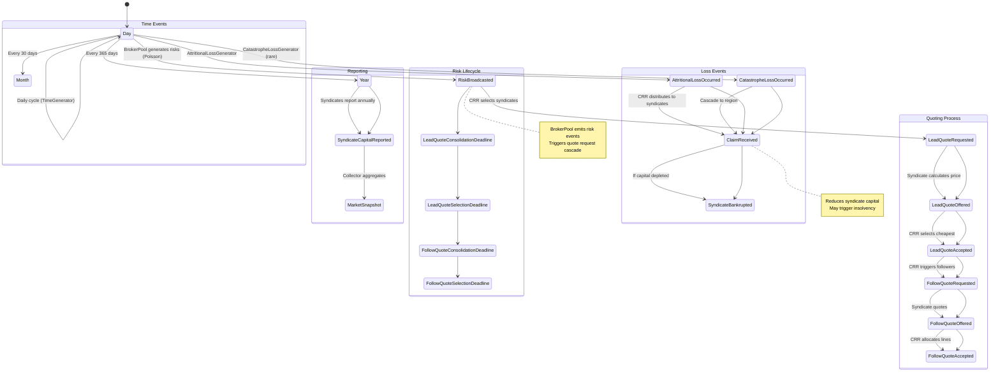
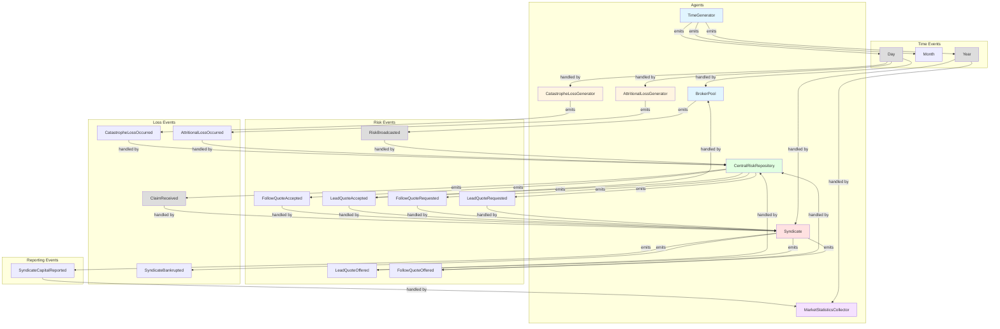

# Lloyd's Insurance Implementation Review (with Diagrams)

**Date**: 2026-02-15
**Scope**: Implementation vs. Olmez et al. (2024) paper goals
**Focus**: Architecture visualization and structural analysis

---

## Summary

The lloyds_insurance implementation has evolved significantly from its initial state. After several iterations of improvements (including BrokerPool consolidation, dividend payments, time series collection, and underwriting markup), the implementation now represents a competent translation of the paper's core mechanisms into the DES framework.

**Key Strengths:**
- ✅ Core economic mechanisms implemented (actuarial pricing, underwriting markup, dividends)
- ✅ Agent consolidation completed (BrokerPool, CentralRiskRepository with syndicate selection)
- ✅ Time series data collection working
- ✅ Event-driven architecture faithfully mirrors paper's process model

**Remaining Gaps:**
- Follow pricing strength mechanism (lead-follow coupling)
- Dynamic industry statistics (hardcoded constants)
- Exposure management (VaR EM, Premium EM)
- State cleanup (unbounded HashMap growth)

---

## Architecture Diagrams

### 1. Current Agent Structure

```mermaid
classDiagram
    class Agent~T,S~ {
        <<trait>>
        +act(current_t, data) Response~T,S~
        +stats() S
    }

    class BrokerPool {
        -config: ModelConfig
        -brokers: Vec~BrokerState~
        -risk_ownership: HashMap~usize,usize~
        +generate_risks_for_all_brokers()
        +handle_lead_quote_accepted()
    }

    class Syndicate {
        -syndicate_id: usize
        -capital: f64
        -policies: Vec~PolicyParticipation~
        -loss_history: Vec~f64~
        -premium_history: Vec~f64~
        -annual_premiums: f64
        -annual_claims: f64
        -markup_m_t: f64
        +calculate_actuarial_price()
        +apply_underwriting_markup()
        +handle_lead_quote_request()
        +handle_claim()
        +handle_year_end()
    }

    class CentralRiskRepository {
        -risks: HashMap~usize,Risk~
        -policies: HashMap~usize,Policy~
        -lead_quotes: HashMap
        -follow_quotes: HashMap
        -config: ModelConfig
        -num_syndicates: usize
        -rng: StdRng
        +select_syndicates_for_lead()
        +select_syndicates_for_follow()
        +register_risk()
        +handle_catastrophe()
    }

    class MarketStatisticsCollector {
        -num_syndicates: usize
        -time_series: TimeSeriesStats
        -pending_reports: HashMap
        +handle_year()
        +handle_syndicate_report()
    }

    class TimeGenerator {
        -current_day: usize
        +new()
    }

    class AttritionalLossGenerator {
        -config: ModelConfig
        -rng: StdRng
        +generate_attritional_losses()
    }

    class CatastropheLossGenerator {
        -config: ModelConfig
        -num_peril_regions: usize
        -rng: StdRng
        +generate_catastrophe_events()
    }

    Agent~Event,Stats~ <|.. BrokerPool : implements
    Agent~Event,Stats~ <|.. Syndicate : implements
    Agent~Event,Stats~ <|.. CentralRiskRepository : implements
    Agent~Event,Stats~ <|.. MarketStatisticsCollector : implements
    Agent~Event,Stats~ <|.. TimeGenerator : implements
    Agent~Event,Stats~ <|.. AttritionalLossGenerator : implements
    Agent~Event,Stats~ <|.. CatastropheLossGenerator : implements

    note for BrokerPool "Manages N broker states internally\nO(1) risk ownership lookup"
    note for Syndicate "Most complex agent\nPricing, exposure, capital mgmt"
    note for CentralRiskRepository "Market coordinator\nFolded syndicate selection logic"
    note for TimeGenerator "Minimal state: just current_day"
    note for MarketStatisticsCollector "Observability agent\nAggregates market snapshots"
```

This diagram shows all agents implementing the DES `Agent<Event, Stats>` trait. The implementation has been streamlined through consolidation—BrokerSyndicateNetwork was removed and its logic folded into CentralRiskRepository, and 25 individual Broker agents were consolidated into a single BrokerPool.



**Key Observations:**
- **BrokerPool**: Consolidates 25 brokers into one agent, reducing broadcast overhead by 24 agents
- **Syndicate**: Stateful agent with rich behavior (pricing, capital, policies, markup)
- **CentralRiskRepository**: Now handles both risk tracking AND syndicate selection (folded from BrokerSyndicateNetwork)
- **TimeGenerator**: Minimal state, acts as a clock
- **MarketStatisticsCollector**: Dedicated observability agent for time series data

---

### 2. Event Flow State Diagram

This diagram shows the complete lifecycle of events in the insurance market simulation, from time progression through risk generation, quoting, policy creation, and loss handling.



**Key Event Patterns:**
1. **Time progression**: Day → Month → Year (TimeGenerator orchestrates)
2. **Risk-to-policy pipeline**: Risk broadcast → Lead quotes → Follow quotes → Policy creation
3. **Loss cascade**: Catastrophe → Region → Risks → Policies → Syndicates
4. **Annual reporting**: Year → Syndicate reports → Market snapshot

---

### 3. Agent-Event Relationships Graph

This graph shows which agents emit and consume which events. Edges indicate "Agent emits Event" or "Event handled by Agent."



**Agent Roles:**
- **TimeGenerator** (blue): Time orchestrator, emits Day/Month/Year
- **BrokerPool** (blue): Risk generator, responds to Day events
- **Syndicate** (red): Core economic agent, handles quotes, claims, capital
- **CentralRiskRepository** (green): Market coordinator, routes events
- **Loss Generators** (yellow): Stochastic loss processes
- **MarketStatisticsCollector** (purple): Observer, aggregates statistics

**Event Coupling Patterns:**
- Tight coupling: RiskBroadcasted → LeadQuoteRequested (CRR orchestrates immediately)
- Loose coupling: Year → SyndicateCapitalReported → MarketSnapshot (async aggregation)
- Broadcast pattern: Day event handled by multiple agents (BrokerPool, Loss Generators)

---

## Architectural Assessment

### Strengths

**1. Agent Consolidation Complete**
- ✅ BrokerPool reduces agent count from 25→1 for brokers
- ✅ BrokerSyndicateNetwork logic folded into CentralRiskRepository
- ✅ Broadcast overhead reduced from 35+ agents to 10 agents

**2. Meaningful Agent Separation**
- Each agent has distinct responsibilities and state
- Syndicate: Complex economic behavior (pricing, capital, exposure)
- CentralRiskRepository: Market coordination and routing
- BrokerPool: Risk generation with O(1) ownership tracking
- MarketStatisticsCollector: Clean observability separation

**3. Event Flow Mirrors Paper**
- Time events → Risk generation → Quote cascade → Policy creation → Loss distribution
- Matches HADES framework's event-driven architecture
- Deadlines create temporal structure in quoting process

### Remaining Architectural Concerns

**1. TimeGenerator as Agent**
The TimeGenerator has minimal state (`current_day: usize`) and exists solely to emit periodic events. This could potentially be replaced with:
- Seed events that self-replicate (Day event schedules next Day event at initialization)
- Framework-level clock mechanism

However, the overhead is minimal (1 agent), and having an explicit TimeGenerator:
- Makes the simulation setup more readable
- Mirrors the paper's "Time Process" concept
- Enables easy modification of time granularity

**Recommendation**: Keep as-is. The conceptual clarity outweighs the minimal overhead.

**2. Unbounded State Growth**

`CentralRiskRepository` stores all risks, quotes, and policies in HashMaps that grow without bound:

```rust
risks: HashMap<usize, Risk>,           // Never cleaned
policies: HashMap<usize, Policy>,      // Never cleaned
lead_quotes: HashMap<...>,             // Never cleaned
follow_quotes: HashMap<...>,           // Never cleaned
```

Over 50 simulated years with ~27k risks, this is tolerable but prevents scaling to longer simulations.

**Recommendation**: Implement state cleanup on risk expiration. When a risk expires (expiration_time < current_t), remove associated quotes, policy, and risk records. This would require:
- Tracking expiration times in CRR
- Periodic cleanup event (e.g., monthly sweep)
- Similar cleanup in Syndicate.policies and loss_history

**3. Hardcoded Industry Statistics**

Syndicates use hardcoded industry averages for pricing:

```rust
let industry_avg_loss = self.config.gamma_mean * self.config.yearly_claim_frequency;
```

The paper describes syndicates receiving dynamic industry-wide statistics that change over time based on actual market experience. This prevents the feedback loop where a catastrophe changes industry pricing.

**Recommendation**:
- MarketStatisticsCollector should emit `IndustryLossStatsReported` events
- Syndicates should track received industry stats and use them in pricing
- Events already defined in Event enum (lines 126-132) but unused

---

## Implementation vs. Paper Checklist

### ✅ Implemented Core Mechanisms

1. **Actuarial Pricing (Equation 2)**: ✅
   - `P̃_t = z·X̄_t + (1-z)·λ'_t·μ'_t`
   - Exponentially weighted moving average of loss history
   - Volatility loading included

2. **Underwriting Markup (Equation 3)**: ✅
   - `P_t = P_at · e^(m_t)`
   - EWMA of market conditions (loss ratios)
   - Implemented in Syndicate::apply_underwriting_markup()

3. **Dividend Payments (Equation 5)**: ✅
   - `D = γ · Pr_t` (40% of annual profit)
   - Syndicates pay dividends on Year events
   - Prevents infinite capital accumulation

4. **Time Series Collection**: ✅
   - MarketStatisticsCollector aggregates market snapshots
   - Annual capital, loss ratios, solvency tracking
   - CSV export working

5. **Catastrophe Loss Distribution**: ✅
   - Pareto-distributed losses by peril region
   - Cascade to all risks in region, then to syndicates
   - CatastropheLossGenerator working

6. **Lead-Follow Structure**: ✅ (partial)
   - CRR selects cheapest lead quote
   - Followers receive FollowQuoteRequested with lead_price
   - Line sizes allocated

### ❌ Not Yet Implemented

1. **Follow Pricing Strength**
   - Paper: Followers compare their price to lead's price to determine line size
   - Current: Follow line sizes are hardcoded (default_follow_line_size)
   - Impact: Cannot replicate Scenario 4's zero-insolvency finding

2. **Dynamic Industry Statistics**
   - Paper: Syndicates receive real-time industry stats (avg claim frequency, cost)
   - Current: Hardcoded constants from config
   - Impact: No feedback loop from catastrophes to market pricing

3. **VaR Exposure Management**
   - Paper: Monte Carlo VaR by peril region, capital threshold checks
   - Current: Not implemented
   - Impact: Cannot test Scenario 3 (VaR EM → uniform deviation → 0)

4. **Premium Exposure Management**
   - Paper: Scale quotes based on premium-to-capital ratio
   - Current: Not implemented
   - Impact: Syndicates don't limit exposure based on capital constraints

5. **State Cleanup**
   - Paper: Implicit (finite simulation horizon)
   - Current: Unbounded HashMap growth
   - Impact: Cannot scale beyond ~50 years

---

## Test Coverage Analysis

The module has extensive integration tests in `lib.rs`:

- `test_market_loss_ratios_are_realistic`: 50-year Scenario 1, checks loss ratio convergence (0.8-1.2)
- `test_premium_convergence_to_fair_price`: Premium stability analysis over time
- `test_catastrophe_driven_cycles`: Scenario 2, verifies cat-driven volatility
- `test_markup_mechanism_validation`: Validates EWMA markup behavior

**Strengths:**
- Long-run simulations (50 years) with full paper setup (5 syndicates, 25 brokers)
- Statistical validation (loss ratios, premiums, markup bounds)
- Temporal dynamics tested (early vs. later periods)

**Gaps:**
- No tests for follow pricing strength (not implemented)
- No tests for dynamic industry stats (not implemented)
- No tests for exposure management (not implemented)
- State cleanup not tested (not implemented)

---

## Recommendations (Prioritized)

### High Priority

1. **Implement Follow Pricing Strength**
   - Enable Scenario 4 validation (zero insolvencies)
   - Core paper contribution: lead-follow coupling reduces volatility
   - Estimated effort: Medium (modify Syndicate::handle_follow_quote_request)

2. **Implement Dynamic Industry Statistics**
   - Enable realistic feedback loops (cat → industry stats → higher premiums)
   - Events already defined, needs wiring
   - Estimated effort: Medium (MarketStatisticsCollector emits, Syndicates consume)

### Medium Priority

3. **Implement VaR Exposure Management**
   - Enable Scenario 3 testing
   - Requires Monte Carlo simulation within Syndicate
   - Estimated effort: High (complex logic, needs verification)

4. **Implement Premium Exposure Management**
   - Simpler than VaR EM
   - Prevents over-exposure based on capital
   - Estimated effort: Low (ratio check + quote scaling)

5. **Add State Cleanup**
   - Enable longer simulations
   - Periodic cleanup on Month events
   - Estimated effort: Medium (need expiration tracking + cleanup logic)

### Low Priority

6. **Tighten Test Bounds**
   - Current loss ratio test accepts 0.5-1.8 (3.6x window)
   - With 50-year runs, can tighten to 0.8-1.2
   - Estimated effort: Trivial (change assertion bounds)

---

## Conclusion

The lloyds_insurance implementation has evolved from a basic skeleton to a working insurance market simulation. The architecture is clean, agents have meaningful separation, and core economic mechanisms (pricing, markup, dividends) are implemented and tested.

The main remaining work is implementing the follow pricing strength mechanism and dynamic industry statistics—both are essential to replicating the paper's key findings about lead-follow coupling and market stability.

**Overall Assessment**: Strong foundation, ready for final mechanisms to enable full paper validation.
